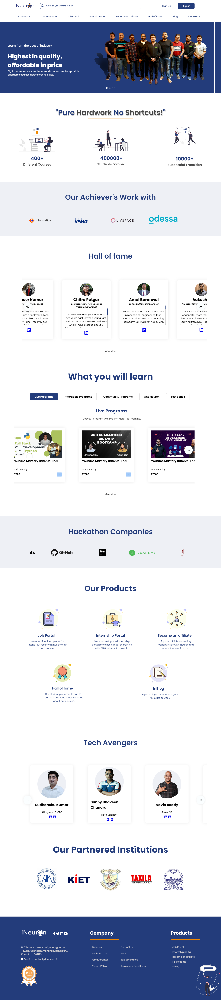

## Hackathon!!

Hi guys, I am Enrolled in the Full Stack Javascript Web Developer program by **iNeuron.ai** and Ineuron has organized a hackathon In which I participated and I had to build a home page of the iNeuron.ai website to make that clone I used HTML, CSS, and javascript. And I didn't use bootstrap to make this page and I have made it responsive without that. In order to make the page responsive, I used media queries. This allowed me to change the layout of the page based on the device it was being viewed on. The Most Challenging part of this Hackathon was slide-show. and I spent straight 2 days learning about the slide-show concepts. I remember those 2 days were very frustrating to me but in the end, I figure it out and I learned so many things. And yes I am very happy with the way my page turned out and I was able to create it without using bootstrap. and I would recommend this approach to others who are in their learning phase please don't use third-party tools.
You might make it look good but real work was done by third-party tools. And I am very happy to be a part of this hackathon thank you **iNeuron.ai** and Hitesh Choudhary for organizing this hackathon.

>

> And I completed it in 3 days although time was given to us was 4 days.

>[Ineuron Home Page Clone](https://ineuron-home-page.netlify.app/)